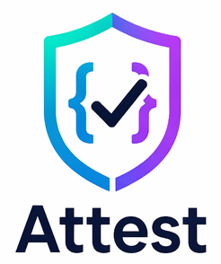

<p align="center">
  
</p>

<h1 align="center">Attest</h1>

<p align="center">
  <strong>Prove you understand the code before it ships.</strong>
</p>

<p align="center">
  A comprehension gate for AI-assisted development that verifies engineers genuinely understand the code they're about to merge — not just that it compiles.
</p>

---

## Why Attest exists

AI can write code faster than humans can internalize it. Code can compile, pass tests, and look perfectly reasonable — while the engineer who submitted it can't explain what it does under load, what assumptions it relies on, or how to debug it at 2am.

Attest closes that gap. It's a comprehension gate that interviews you about your actual diff, scales question depth to risk level, and leaves behind auditable evidence of understanding. Not a linter. Not a test suite. A proof that a human is in the loop — and actually in command.

## What Attest does

Attest is an **OpenCode plugin** that conducts a targeted interview grounded in your actual code diff before a pull request is opened.

- **Inspects** your local code changes
- **Classifies risk** — sensitive changes (auth, crypto, billing, migrations) get deeper scrutiny
- **Asks targeted questions** — calibrated to the change's risk level (2–5 questions)
- **Evaluates answers** — assesses whether understanding is genuine
- **Records evidence** — writes durable, auditable artifacts (JSON + Markdown)
- **Returns a verdict** — `PASS`, `PASS_WITH_WARNINGS`, `NEEDS_FOLLOWUP`, or `ESCALATE_TO_HUMAN`

## How it works

```
/attest
  → Declare intent (summary, motivation, AI disclosure)
  → Diff collected (staged or branch)
  → Risk classified (deterministic pattern matching)
  → Interview depth selected (low: 2, medium: 3, high: 5 questions)
  → Questions generated (grounded in actual diff)
  → Answers collected (interactive)
  → Answers evaluated
  → Escalation rules applied (deterministic)
  → Verdict computed (deterministic)
  → Evidence artifacts written
  → Verdict rendered
```

## Key features

| Feature | Detail |
|---------|--------|
| **Risk-aware depth** | Low-risk (docs, tests): 2 questions. Medium (business logic): 3. High (auth, crypto, billing): 5. |
| **Deterministic policy** | Risk classification, verdict computation, and escalation rules are fully deterministic and auditable. |
| **Durable evidence** | Machine-readable JSON and human-readable Markdown artifacts for every run. |
| **Session resume** | Interrupted interviews can be resumed without starting over. |
| **Strict LLM contract** | LLM calls are behind a contract boundary with schema validation — behavior stays predictable. |
| **Intent declaration** | Engineers declare their change summary, motivation, and AI usage upfront. |

## Commands

| Command | Description |
|---------|-------------|
| `/attest` | Run against staged changes (default). Pass `branch` to diff against base branch instead. |
| `/attest-resume` | Resume an interrupted session |

## Diff modes

Attest supports three diff modes for collecting the code changes to interview against:

| Mode | Trigger | Behavior |
|------|---------|----------|
| `staged` | Default (or configured via `defaultDiffMode`) | Analyzes `git diff --cached` |
| `working_tree` | Automatic fallback if nothing is staged | Analyzes `git diff` (unstaged changes) |
| `branch` | `/attest branch` | Analyzes `git diff <baseBranch>...HEAD` |

Auto-detection order: if no explicit mode is requested, Attest checks for staged changes first, then working tree changes, then falls back to a branch diff.

## Configuration

Attest works with zero configuration out of the box. To customize behavior, create an optional `.attest/config.json` in your repository root:

```json
{
  "defaultDiffMode": "staged",
  "baseBranch": "main",
  "maxDiffCharacters": 12000,
  "evidenceDirectory": ".attest/runs",
  "maxQuestionsByRisk": {
    "low": 2,
    "medium": 4,
    "high": 6
  },
  "allowFollowUps": true
}
```

| Option | Default | Description |
|--------|---------|-------------|
| `defaultDiffMode` | `"staged"` | Which diff mode to use when no argument is passed (`staged`, `working_tree`, or `branch`) |
| `baseBranch` | `"main"` | Branch to diff against when using `branch` mode |
| `maxDiffCharacters` | `12000` | Maximum diff size (in characters) sent to the LLM |
| `evidenceDirectory` | `".attest/runs"` | Where evidence artifacts are written |
| `maxQuestionsByRisk` | `{ low: 2, medium: 4, high: 6 }` | Maximum questions per risk level (configurable ceiling) |
| `allowFollowUps` | `true` | Whether follow-up questions are permitted |

All fields are optional — any omitted field uses its default value.

## Installation

This package is published on [npm](https://www.npmjs.com/package/@weaveio/opencode_attest).

### Prerequisites

- [OpenCode](https://opencode.ai)

### Step 1: Install the plugin in OpenCode

If you're working with an LLM inside OpenCode, you can ask it to install the plugin for you instead of manually hunting down `opencode.json`.

Example prompt:

```text
Please install the OpenCode plugin `@weaveio/opencode_attest` for me by updating my OpenCode plugin configuration.
If the `plugin` array already exists, add it there.
If not, create it in the correct `opencode.json` file.
Then ask me to restart OpenCode.
```

If you're doing it manually, add the plugin to your `opencode.json` file:

```json
{
  "plugin": ["@weaveio/opencode_attest"]
}
```

### Step 2: Restart OpenCode

OpenCode automatically installs npm plugins at startup — no manual `bun add` or `npm install` required. The plugin loads automatically upon restart and works with zero configuration out of the box.

### Troubleshooting

| Issue | Solution |
|-------|----------|
| `404 Not Found` | Ensure the package name is correct: `@weaveio/opencode_attest`. |
| Package not found after publish | npm can take a few minutes to propagate. Wait and retry. |

## Uninstalling

### Step 1: Remove from opencode.json

Delete the `@weaveio/opencode_attest` entry from the `plugin` array in your `opencode.json`.

### Step 2: Clean up artifacts (optional)

Remove Attest runtime state if no longer needed:

```bash
rm -rf .attest/
```

## Development

- **Build**: `bun run build`
- **Test**: `bun test`
- **Typecheck**: `bun run typecheck`

See [docs/testing-strategy.md](docs/testing-strategy.md) for details.

## Repository layout

```text
src/                    Source code with co-located unit tests
  commands/             Command definitions and handlers
  config/               Configuration loading
  domain/               Core domain models
  evidence/             Evidence artifact writing
  flow/                 Orchestration flows
  git/                  Git integration
  llm/                  LLM contract layer
  path/                 Path utilities
  policy/               Deterministic policy engine
  session/              Session persistence
  ui/                   User interface rendering
test/
  integration/          Fixture-based integration tests
  e2e/                  End-to-end and plugin loading tests
  testkit/              Shared test fixtures and utilities
evals/                  Behavioral eval harness
  cases/                Eval case definitions
script/                 Build scripts
docs/                   Architecture and strategy documentation
dist/                   Build output (generated)
```

## Evidence artifacts

Attest writes local artifacts under:

- `.attest/runs/*.json` — machine-readable evidence
- `.attest/runs/*.md` — human-readable evidence
- `.attest/sessions/*.json` — interrupted session state

## Design principles

- **Understanding over output** — passing tests ≠ understanding the change
- **Evidence over intuition** — leave behind durable records, not just verdicts
- **Risk-based, not uniform** — sensitive changes get deeper scrutiny
- **Local-first for the pilot** — keep close to the developer workflow
- **Structured, not ad hoc** — grounded in actual diff and declared intent

## Deterministic vs LLM-backed

| Layer | Scope |
|-------|-------|
| **Deterministic** | Diff inspection, config loading, risk classification, escalation rules, verdict policy, session persistence, evidence writing |
| **LLM-backed** | Question generation, answer evaluation (behind strict contract boundary with schema validation) |

See [docs/architecture.md](docs/architecture.md) for details.

## Relationship to Weave

Attest fits naturally with Weave's structured workflow model. Where Weave adds planning, review, orchestration, and auditability to AI coding workflows, Attest focuses on one question:

> **Can the person submitting this change actually explain and own it?**

- Weave: https://tryweave.io/
- OpenCode Weave: https://github.com/pgermishuys/opencode-weave

## Documentation

- [Architecture](docs/architecture.md)
- [Testing Strategy](docs/testing-strategy.md)
- [Releasing](docs/releasing.md)

---

<p align="center">
  <strong>Attest — because compiling isn't understanding.</strong>
</p>
